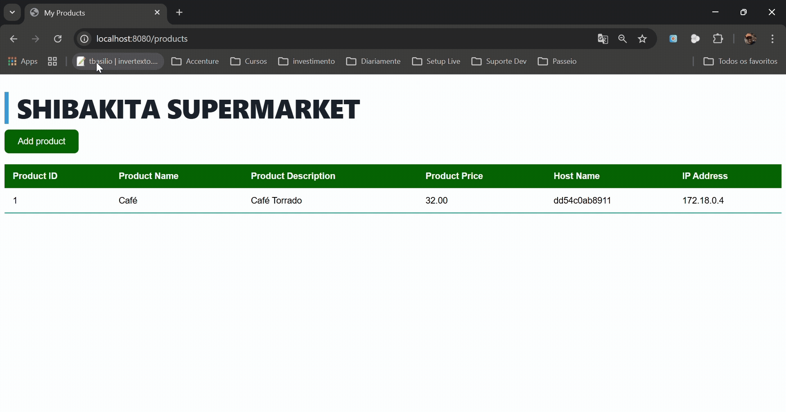

# 👲 Toshiro Shibakita Supermaket

> **Toshiro Shibakita**: É uma pequena aplicação Java de demonstração para simular um cenário de um ambiente de 
> microsserviços.  
> No diretório `src/main` esta localizado os aquivos fontes da aplicação na qual faz o uso do springframework com os 
> starters: *web*, *data-jpa* e *thymeleaf*    
> A aplicação possui uma página estática com um botão em que ao ser acionado, atualiza a página que consequentemente
> chama os serviços de persistência.
---

## 📋 Pré-requisitos

- [Docker](https://docs.docker.com/get-docker/) instalado
- [Docker Compose](https://docs.docker.com/compose/) (ou `docker compose` integrado ao Docker Desktop)

> **Versões mínimas sugeridas**
> - Docker Engine 19.8+
> - Docker Compose v2+

---

## 🗂️ Estrutura típica do projeto

```
.toshiro-shibakita
├── docs/
├── nginx/                 # Construção do proxy reverso
│       └── Dockerfile
│       └── nginx.config
├── src/                   # Código-fonte da aplicação
├── docker-compose.yml     # Serviços: Database | Aplicação | Proxy
├── Dockerfile             # Construção do servidor da aplicação
└── README.md
```

---

## ⚡ Início Rápido

Se você quer subir tudo com o Compose (recomendado):

```bash
# 1) Clone o projeto
git clone git@github.com:t-basilio/toshiro-shibakita.git

# 2) subir os serviços em segundo plano escalando o serviço da aplicação
docker compose up -d --scale shibakita-api=2

# 3) Ver logs
docker compose logs -f

# 4) Acesse a aplicação
# Exemplo: http://localhost/products (Ou especificando a porta caso tenha alterado, http://localhost:8080/products )
```
---

## 🌐 Demonstração
Perceba que as colunas **Host Name** e **IP Address** mudam a cada inclusão de produto na tabela



---

## 🔍 Troubleshooting

- **Porta já em uso**: ajuste a porta no serviço de proxy `shibakita-proxy` que é responsável por receber as requisições.
- **Derrube e levante**: após o ajuste execute os camandos: `docker compose down` e `docker compose up --build`

Lugar para alterar a porta, caso a porta 80 da sua estação de trabalho esteja em uso:

```yaml
# Trecho para alterar a porta no arquivo docker-compose.yml
shibakita-proxy:
  build: ./nginx
  image: shibakita-proxy
  ports:
    - '80:80' #sugestão: '8080:80'
  networks:
    - shibakita-network
  depends_on:
    - shibakita-api
```